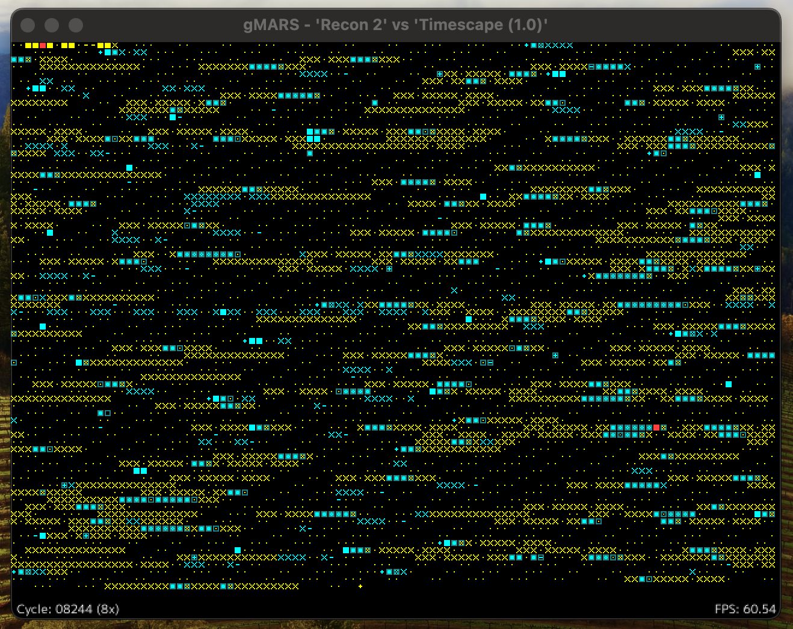

# gMARS

[](https://pkg.go.dev/github.com/bobertlo/gmars/)
[](https://goreportcard.com/report/github.com/bobertlo/gmars)

gMARS is an implementation of a Core War Memory Array Redcode Simulator (MARS)
written in Go.



In the the game of Core War, two virus-like programs written in assembly fight
against each other in the memory of a Simulator where they are able to write and
execute new code and modify eachother. For more information about Core War see:

- [Wikipedia](https://en.wikipedia.org/wiki/Core_War): CoreWar entry
- [corewar.co.uk](https://corewar.co.uk/): John Metcalf's Core War Site with
   tutorials, history, and links.
- [KOTH.org](http://www.koth.org/): A King of the Hill server with ongoing
   competitive matches, information, and links.
- [Koenigstuhl](https://asdflkj.net/COREWAR/koenigstuhl.html): An 'infinite
   hill' site that collects warriors and publishes their rankings and source
   code.

## Why another MARS?

gMARS was created to provide a reference implementation of a MARS in Go. There
are many other implementations but I wanted to meet the following requirements:

1. A thread-safe library implementing the MARS mechanics.
2. Strong compliance to standards, with R/W limits and '88 rules enforcment.
3. Reporting hooks to support custom front-ends and analysis engines.
4. A modern visual simulator front-end.

## Running the Simulator

Currently only two warrior matches are supported and the warrior files must be
supplied as command line arguments. Both versions also accept the following
arguments

```
  -preset string
        Load named preset config (and ignore other flags)
  -8    Enforce ICWS'88 rules
  -F int
        fixed position of warrior #2
  -c int
        Cycles until tie (default 80000)
  -debug
        Dump verbose debug information
  -l int
        Max. warrior length (default 100)
  -p int
        Max. Processes (default 8000)
  -r int (CLI only)
        Rounds to play (default 1)
  -s int
        Size of core (default 8000)
```

### Presets

You can use the `-preset <name>` flag to use a named presed configuration. If a
preset is loaded, the other flags are not parsed and applied.

| Name    | Simulator Mode | CoreSize | Length | Processes | Cycles |
|---------|----------------|----------|--------|-----------|--------|
| nop94   | `NOP94`        | 8000     | 100    | 8000      | 80000  |
| 88      | `ICWS88`       | 8000     | 100    | 8000      | 80000  |
| icws    | `ICWS88`       | 8192     | 300    | 8000      | 100000 |
| noptiny | `NOP94`        | 800      | 20     | 800       | 8000   |
| nop256  | `NOP94`        | 256      | 10     | 60        | 2560   |
| nopnano | `NOP94`        | 80       | 5      | 80        | 800    |

### Visual MARS Controls

Keyboard controls:

- `Space` to start/pause the simulation
- `Up/Down` to increase or decrease simulation speed
- `Left/Right` to stop or step forward one frame of the simulation (at the
   visualizer speed)
- `R` to reset the simulator with the next starting position
- `Escape` to quit

Extra Arguments:

- `-showread`: Enable recording and rendering of CoreRead states.

### CLI MARS

When the simulation completes in the gmars CLI, a line is printed for each
warrior with the number of wins and ties:

```
1 0
0 0 
```

## Implemented Features

- Compilation of code compliant with the ICWS'94 standard specification
   (favoring pMARS compatibility when applicable)
- ICWS'88 compilation mode to enforce valid code generation.
- Simulation of two warrior battles
- Read/write limits (implemented, but not thoroughly tested)
- Hooks generating updates for visualization and analysis
- Visual MARS with interactive keyboard controls

## Planned Features

- P-Space support
- Interactive debugger
- Round robin and benchmark modes

## Language Support

I have implemented the ICWS'94 Draft Standard to the best of my ability and
added the following modifications based pMARS and other simulators:

### Empty Fields

In the draft standard, if only a single operand is applied, it is placed in the
B-Field for `DAT` instructions, or otherwise placed in the A-Field. In both
cases `#0` is supposed to be placed in the remaining field.

I found that corewin and pMARS load `$0` into the B-Field when the instruction
opcode is not `DAT`. Since this can cause divergent outcomes, I chose to follow
other simulators for compatibility.

### FOR/ROF Macros

`FOR` and `ROF` pseudo-opcodes have been added including labels and embedded for
loops.

```
<start_ref...> <count_var> FOR <count_expr>
...
ROF
```

The count variable starts at 1 and increments for each following line until it
equals the value of the count expression. Other labels added before the count
variable name will be evaluated as line references to the first line emitted by
the macro.

Variable concatenation with the `&` pseudo op is not implemented but planned.

#### Start Address Example

```
start i FOR 2
DAT start, i
ROF
```

Compiles to:

```
DAT.F  $  0, $  1
DAT.F  $ -1, $  2
```

#### Embedded Loop Example

```
i FOR 2
j FOR 2
DAT i, j
ROF
ROF
```

Compiles to:

```
DAT.F  $  1, $  1
DAT.F  $  1, $  2
DAT.F  $  2, $  1
DAT.F  $  2, $  2
```

### Non-Supported Extensions

pMARS allows assignment to variables with a syntax appearing as
`(a=CORESIZE/2)`. This feature is not currently implemented, and I am not sure
if I will plan to do so.

## Testing Status / Known Bugs

The compiler is more subjective and still going through testing and active
development, but the backend has been tested fairly thoroughly by running
compiled load code and comparing outcomes to pMARS.

Load code tests were done with the 94nop and 88
[Koenigstuhl](https://asdflkj.net/COREWAR/koenigstuhl.html) hills. I found a
single warrior [Rush
(11,1)](https://asdflkj.net/COREWAR/94/HILL32/rush_11_1.red) that has
inconsistent outcomes, which I am stil investigating.
